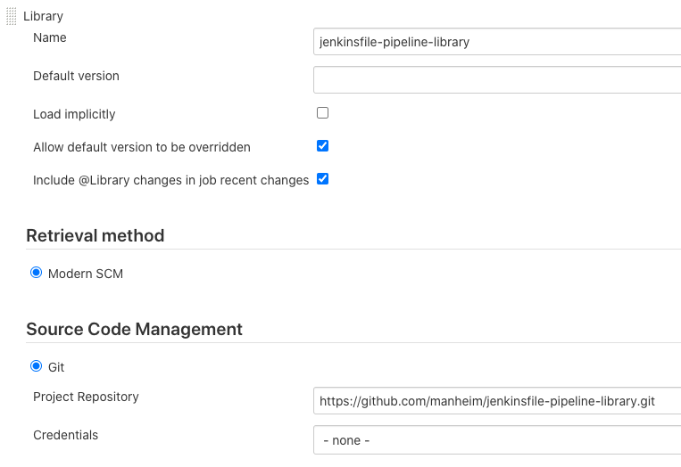
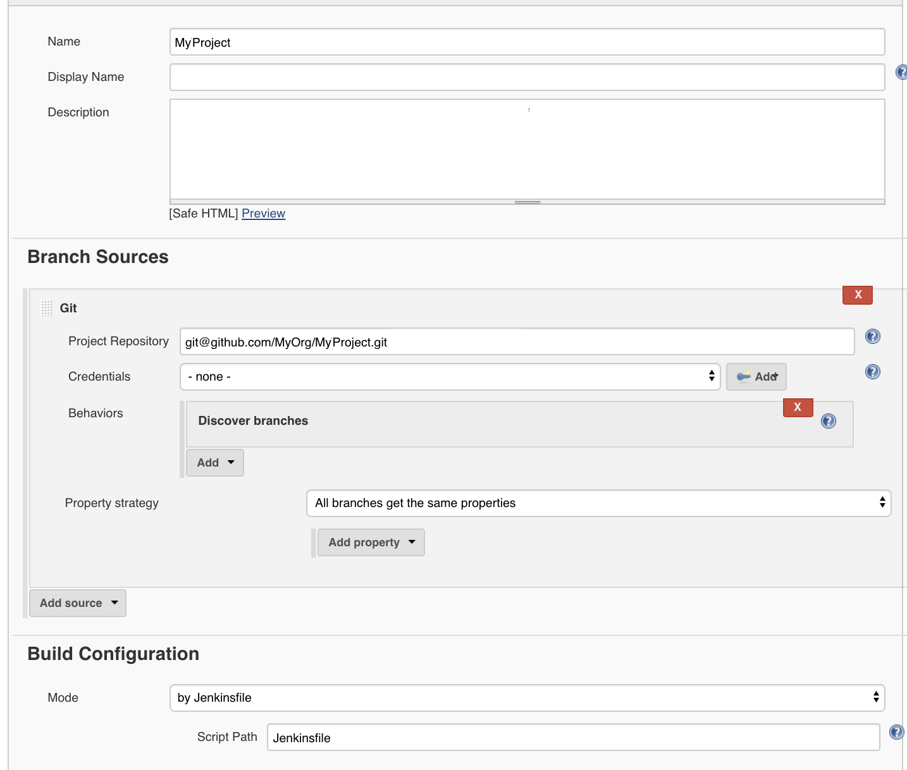
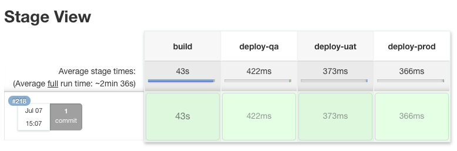
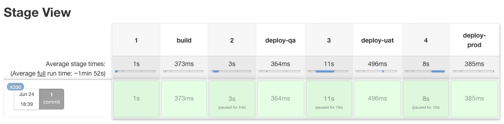
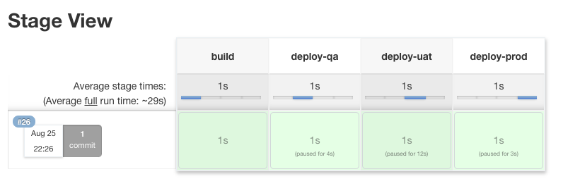
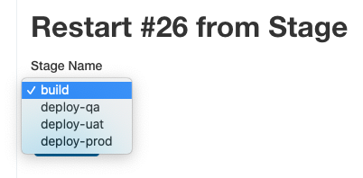

# jenkinsfile-pipeline-library
A reusable pipeline template to build and deploy an application serially across multiple environments.

# Requirements and Assumptions
1.  You have an application that can build an artifact that can be deployed.  By default, the artifact will be built with `./bin/build.sh`, but this can be changed.
2.  Your application artifact can be deployed to an environment.  By default, the artifact will be deployed with `./bin/deploy.sh`, but this can be changed.
3.  You've imported jenkinsfile-pipeline-library to your Jenkins instance.


# How to Use
1.  Create a Jenkinsfile in your application project and import the [version](https://github.com/manheim/jenkinsfile-pipeline-library/releases) of jenkinsfile-pipeline-library that you want to use.  It's recommended that you always use the latest version.
```
// Jenkinsfile
@Library('jenkinsfile-pipeline-library@<VERSION>') _
```
2.  Provide jenkinsfile-pipeline-library with a reference to the Jenkinsfile context, so it can do all of it's magic under the hood.
```
// Jenkinsfile
...
Jenkinsfile.init(this)
```
3.  Start your pipeline by building your deployment artifact.
```
// Jenkinsfile
...
def buildArtifact = new BuildStage()
```
4.  Create a DeployStages for each of the environments that you would normally deploy to.  This example deploys to qa, uat, and prod environments.  The number and names of your environments can differ from this example.  Choose the environments and environment names that reflect your own development process to go from Code to Customer.
```
// Jenkinsfile
...
def deployQa = new DeployStage('qa')
def deployUat = new DeployStage('uat')
def deployProd = new DeployStage('prod')
```
5.  Link the Stages together in the order that you want them to run.  This examples builds your deployment artifact, then deploys qa, then uat, then prod.  Each step *MUST* succeed before it can proceed on to the next.
```
// Jenkinsfile
...
buildArtifact.then(deployQa)
             .then(deployUat)
             .then(deployProd)
```
6.  The design of this library is influenced by the [Builder Pattern](https://en.wikipedia.org/wiki/Builder_pattern) - your pipeline has been configured, but hasn't been constructed just yet.  Finalize and create your pipeline by calling the `build()` method.  This should only be done once - no code should come after calling this method.
```
// Jenkinsfile
...
        .build()
```

7.  From beginning to end, your Jenkinsfile should roughly look like this:

```
@Library('jenkinsfile-pipeline-library@<VERSION>']) _

Jenkinsfile.init(this)

def buildArtifact = new BuildStage()
def deployQa = new DeployStage('qa')
def deployUat = new DeployStage('uat')
def deployProd = new DeployStage('prod')

buildArtifact.then(deployQa)
             .then(deployUat)
             .then(deployProd)
             .build()
```

8.  Load your project into Jenkins, and point it to your newly created Jenkinsfile.
    1. Create a new job using the 'New Item' menu

       
    2. Select Multibranch Pipeline after naming your new job

       
    3. Configure your new job, and point it to the location of your source code.

       

9.  If everything was successful, you should see something like this:



# Declarative Pipelines vs Scripted (+Restart From Stage)

Jenkinsfile has a number of quirks, which in turn creates a number of frustrating short-comings.  The most noticeable quirk is the two distinctive syntaxes for creating a pipeline:

1. [Declarative Pipelines](https://jenkins.io/doc/book/pipeline/syntax/#declarative-pipeline)
2. [Scripted Pipelines](https://jenkins.io/doc/book/pipeline/syntax/#scripted-pipeline)

Scripted Pipelines are much easier to work with, and offer a lot of flexibility and programmability.  Declarative Pipelines on the otherhand, are much less flexible, but offer the really important feature known as ['Restart From Stage'](https://jenkins.io/doc/book/pipeline/running-pipelines/#restart-from-a-stage) - the ability to re-run portions of a previous pipeline run.

jenkinsfile-pipeline-library attempts to abstract away these two different types of pipelines, so that you can get the features that you want, without needing to write your pipeline code in a specific/arbitrary way.

By default, your pipeline will be a Declarative Pipeline.  If for some reason you need your pipeline to be a Scripted Pipeline, you can do so by disabling the declarative flag:

```
Jenkinsfile.declarative = false
```

A short-coming of Declarative Pipelines is the inability to use variables when defining Stage names (See: [JENKINS-43820](https://issues.jenkins-ci.org/browse/JENKINS-43820)).  The compromise made by terraform-pipeline is to name each of the top-level Stage names using consecutive numbers '1', '2', '3', etc.  The following code:

```
@Library('jenkinsfile-pipeline-library') _

Jenkinsfile.init(this)

def buildArtifact = new BuildStage()
def deployQa = new DeployStage('qa')
def deployUat = new DeployStage('uat')
def deployProd = new DeployStage('prod')

buildArtifact.then(deployQa)
             .then(deployUat)
             .then(deployProd)
             .build()
```

will produce a Declarative Pipeline that looks like this:



When using the Restart from Stage feature, you'll need to map the numbered Stages to the Stages that you've defined in your Jenkinsfile.  In this example, 1 = Validate, 2 = Qa, 3 = Uat, 4 = Prod.


Mapping arbitrary numbers to your Stages can likely be annoying.  If you want to give your Stages more meaningful names, you can override the underlying Declarative Pipeline template with your own, using the `Jenkinsfile.pipelineTemplate` variable, and a Customizations library (See: [DRY'ing your Plugin Configuration](#drying-your-plugin-configuration)).

As an example, we'll create a `vars/CustomPipelineTemplate.groovy` in our customizations library, and define top-level Stages that match the Stages of our pipeline - `Validate`, `Qa`, `Uat`, and `Prod`.

```
// jenkinsfile-pipeline-library-customizations/vars/CustomPipelineTemplate.groovy

def call(stages) {
    pipeline {
        agent none

        stages {
            stage('Validate') {
                steps {
                    script {
                        ((Stage)stages.getAt(0)).build()
                    }
                }
            }

            stage('Qa') {
                steps {
                    script {
                        ((Stage)stages.getAt(1)).build()
                    }
                }
            }

            stage('Uat') {
                steps {
                    script {
                        ((Stage)stages.getAt(2)).build()
                    }
                }
            }

            stage('Prod') {
                steps {
                    script {
                        ((Stage)stages.getAt(3)).build()
                    }
                }
            }
        }
    }
}
```

In your Jenkinsfile, override the default pipelineTemplate, and point it to your new pipeline template function.  For example:

```
@Library(['jenkinisfile-pipeline-library', 'jenkinsfile-pipeline-library-customizations']) _

Jenkinsfile.init(this)
Jenkinsfile.pipelineTemplate = this.CustomPipelineTemplate

def buildArtifact = new BuildStage()
def deployQa = new DeployStage('qa')
def deployUat = new DeployStage('uat')
def deployProd = new DeployStage('prod')

buildArtifact.then(deployQa)
             .then(deployUat)
             .then(deployProd)
             .build()
```

This will generate a new Declarative Pipeline, using your custom template.



Restart from Stage will now display more sensible names.  __Note:__ This is in __NO__ way dynamic.  If you reorder the Stages in your Jenkinsfile, you'll need to reorder the Stage names in your custom template.  This is an unfortunate side-effect of the strict syntax of Declarative Pipelines.



# How to Contribute

1.  Fork this project.
2.  Make your changes and run the tests with `./gradlew test`.
3.  Validate your changes by pointing a terraform-pipeline project to your fork.
4.  Update the CHANGELOG with your changes.  Changes are queued under "Unreleased", until an official release is cut.
5.  Your PR will be reviewed and merged into a release branch.
6.  Release branches are periodically reviewed, then merged into master.  An official release is then published, and the release branch is deleted.

# Goals that this library is trying to achieve:

1.  Application code should be written once, and should be reusable for all environments.
    1.  Configuration, especially environment-specific configuration, should be externalized.  Where it's externalized to should be irrelevant.
2.  As much as possible, a pipeline should reflect what teams do to get from Code to Customer - no more, but also no less.
    1.  Allow teams to specify their own steps in that process, and teams should choose how those steps are linked together.
    2.  This is an OpenSource project - defaults should make reasonable sense for anyone that happens to use this project.
3.  Apply the [Open/Closed Principle](https://en.wikipedia.org/wiki/Open%E2%80%93closed_principle)
    1.  You should rarely need to change the base code, everything should be open for extension without modification to the base code.
    2.  It should be possible to add behaviors through Plugins and Decorations - this makes behavior addable/removable/extenable.
    3.  Think of plugins as interchangeable Lego pieces - you can swap one piece out for another, without fundamentally altering what it is to be a Pipeline.
4.  There should only be one way to Production, and that way should be crystal clear.
    1.  The master branch (or its equivalent) is the one-and-only way to Production.

